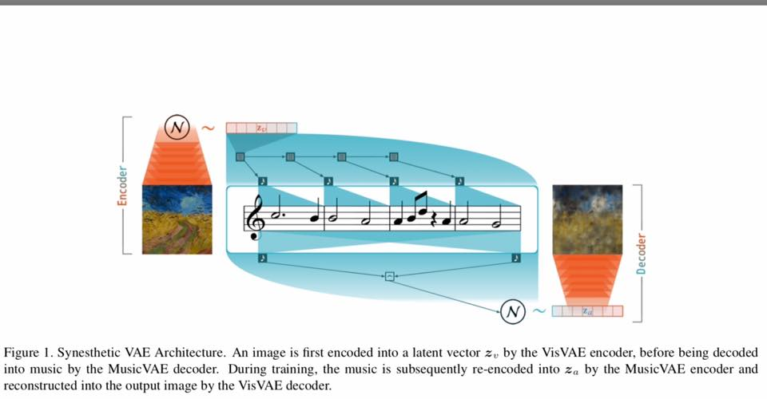
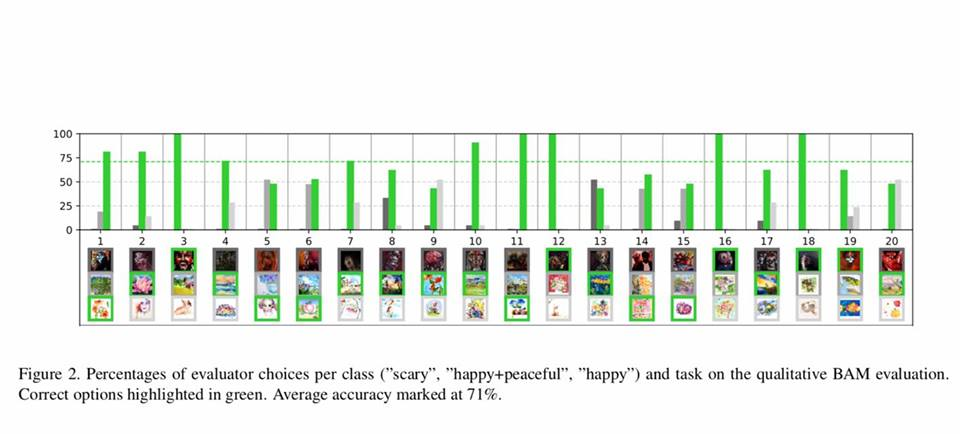

# Synesthetic-Variational-Autoencoder-SynVAE-

Artificial Intelligence can translate visual art work into nice music melody.
Brilliant work by the University of Amsterdam team on Synesthetic Variational Autoencoder (SynVAE), which maps characteristics of paintings/visual art to musical phrases with accuracies of up to 73%.

Read https://arxiv.org/pdf/1909.01218.pdf
Watch https://youtu.be/owGRJktHmDk

#artificialintelligence #machinelearning
